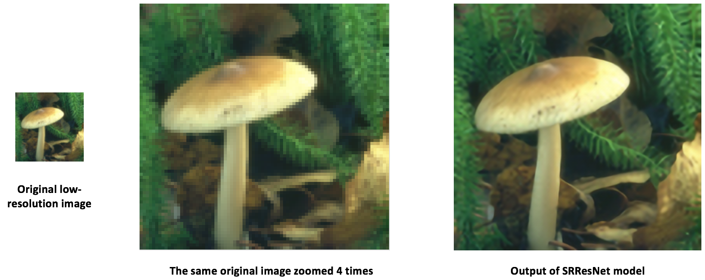

# 使用 ONNX 将模型从 PyTorch 迁移到 Caffe2 和 Mobile

在本教程中, 我们将介绍如何使用 ONNX 将 PyTorch 中定义的模型转换为 ONNX 格式, 然后将其加载到 Caffe2 中. 一旦进入 Caffe2 , 我们可以运行该模型以仔细检查它是否正确导出, 然后演示如何使用 Caffe2 功能（例如移动导出器）在移动设备上执行模型.

在本教程中, 您需要安装 [onnx](https://github.com/onnx/onnx), [onnx-caffe2](https://github.com/onnx/onnx-caffe2) 和 [Caffe2](https://caffe2.ai/). 你可以通过 `conda install -c ezyang onnx onnx-caffe2` 用 onnx 和 onnx-caffe2 获得二进制版本.

`NOTE`: 本教程需要 PyTorch 主分支, 可以按照 [here](https://github.com/pytorch/pytorch#from-source) 的说明进行安装

```py
# Some standard imports
import io
import numpy as np

from torch import nn
from torch.autograd import Variable
import torch.utils.model_zoo as model_zoo
import torch.onnx

```

Super-resolution 是提高图像, 视频分辨率的一种方式, 广泛用于图像处理或视频编辑. 对于本教程, 我们将首先使用带有虚拟输入的小型 super-resolution 模型.

首先, 让我们在 PyTorch 中创建一个 SuperResolution 模型. [这个模型](https://github.com/pytorch/examples/blob/master/super_resolution/model.py) 直接来自 PyTorch 的例子而没有修改:

```py
# Super Resolution model definition in PyTorch
import torch.nn as nn
import torch.nn.init as init

class SuperResolutionNet(nn.Module):
    def __init__(self, upscale_factor, inplace=False):
        super(SuperResolutionNet, self).__init__()

        self.relu = nn.ReLU(inplace=inplace)
        self.conv1 = nn.Conv2d(1, 64, (5, 5), (1, 1), (2, 2))
        self.conv2 = nn.Conv2d(64, 64, (3, 3), (1, 1), (1, 1))
        self.conv3 = nn.Conv2d(64, 32, (3, 3), (1, 1), (1, 1))
        self.conv4 = nn.Conv2d(32, upscale_factor ** 2, (3, 3), (1, 1), (1, 1))
        self.pixel_shuffle = nn.PixelShuffle(upscale_factor)

        self._initialize_weights()

    def forward(self, x):
        x = self.relu(self.conv1(x))
        x = self.relu(self.conv2(x))
        x = self.relu(self.conv3(x))
        x = self.pixel_shuffle(self.conv4(x))
        return x

    def _initialize_weights(self):
        init.orthogonal(self.conv1.weight, init.calculate_gain('relu'))
        init.orthogonal(self.conv2.weight, init.calculate_gain('relu'))
        init.orthogonal(self.conv3.weight, init.calculate_gain('relu'))
        init.orthogonal(self.conv4.weight)

# Create the super-resolution model by using the above model definition.
torch_model = SuperResolutionNet(upscale_factor=3)

```

通常, 你现在要训练这个模型; 但是, 对于本教程, 我们将下载一些预先训练的权重. 请注意, 该模型没有得到充分训练以获得良好的准确性, 因此仅用于演示目的.

```py
# Load pretrained model weights
model_url = 'https://s3.amazonaws.com/pytorch/test_data/export/superres_epoch100-44c6958e.pth'
batch_size = 1    # just a random number

# Initialize model with the pretrained weights
map_location = lambda storage, loc: storage
if torch.cuda.is_available():
    map_location = None
torch_model.load_state_dict(model_zoo.load_url(model_url, map_location=map_location))

# set the train mode to false since we will only run the forward pass.
torch_model.train(False)

```

在PyTorch中导出模型通过跟踪工作.要导出模型, 请调用该 `torch.onnx._export()` 函数. 这将执行模型, 记录运算符用于计算输出的轨迹.由于 `_export` 运行模型, 我们需要提供一个输入张量 `x`. 这个张量中的值并不重要; 只要尺寸合适, 它可以是图像或随机张量.

要了解更多关于 PyTorch 导出界面的细节, 请查看 [torch.onnx文档](http://pytorch.org/docs/master/onnx.html).

```py
# Input to the model
x = Variable(torch.randn(batch_size, 1, 224, 224), requires_grad=True)

# Export the model
torch_out = torch.onnx._export(torch_model,             # model being run
                               x,                       # model input (or a tuple for multiple inputs)
                               "super_resolution.onnx", # where to save the model (can be a file or file-like object)
                               export_params=True)      # store the trained parameter weights inside the model file

```

`torch_out` 是执行模型后的输出.通常情况下, 您可以忽略此输出, 但在此我们将使用它来验证我们导出的模型在 Caffe2 中运行时计算相同的值.

现在我们来看看 ONNX 表示法, 并在 Caffe2 中使用它. 这部分通常可以在单独的进程或另一台机器上完成, 但我们将继续使用相同的过程, 以便我们可以验证 Caffe2 和 PyTorch 是否为网络计算相同的值:

```py
import onnx
import onnx_caffe2.backend

# Load the ONNX ModelProto object. model is a standard Python protobuf object
model = onnx.load("super_resolution.onnx")

# prepare the caffe2 backend for executing the model this converts the ONNX model into a
# Caffe2 NetDef that can execute it. Other ONNX backends, like one for CNTK will be
# availiable soon.
prepared_backend = onnx_caffe2.backend.prepare(model)

# run the model in Caffe2

# Construct a map from input names to Tensor data.
# The graph of the model itself contains inputs for all weight parameters, after the input image.
# Since the weights are already embedded, we just need to pass the input image.
# Set the first input.
W = {model.graph.input[0].name: x.data.numpy()}

# Run the Caffe2 net:
c2_out = prepared_backend.run(W)[0]

# Verify the numerical correctness upto 3 decimal places
np.testing.assert_almost_equal(torch_out.data.cpu().numpy(), c2_out, decimal=3)

print("Exported model has been executed on Caffe2 backend, and the result looks good!")

```

我们应该看到 PyTorch 和 Caffe2 的输出在数字上匹配达到3位小数. 作为旁注, 如果它们不匹配, 那么 Caffe2 和 PyTorch 中的操作符的实现方式会有所不同, 请在此情况下与我们联系.

## 使用 ONNX 迁移到 SRResNet

使用与上述相同的过程, 我们还为 [本文](https://arxiv.org/pdf/1609.04802.pdf) 提出了一个有趣的新的 super-resolution 模式 “SRResNet” (感谢 Twitter 上的作者为我们提供了代码和预训练参数, 以用于本教程). 模型定义和预先训练的模型可以在 [这里](https://gist.github.com/prigoyal/b245776903efbac00ee89699e001c9bd) 找到. 以下是 SRResNet 模型输入, 输出的样子. 

## 在移动设备上运行模型

到目前为止, 我们已经从 PyTorch 中导出了一个模型, 并展示了如何加载它并在 Caffe2 中运行它. 现在该模型已经加载到 Caffe2 中, 我们可以将其转换为适合 [在移动设备上运行](https://caffe2.ai/docs/mobile-integration.html) 的格式.

我们将使用 Caffe2 的 [mobile_exporter](https://github.com/caffe2/caffe2/blob/master/caffe2/python/predictor/mobile_exporter.py) 来生成可以在移动设备上运行的两个模型 protobufs. 第一个用于使用正确的权重初始化网络, 第二个实际运行用于执行模型. 我们将继续在本教程的其余部分使用小型 super-resolution 模型.

```py
# extract the workspace and the model proto from the internal representation
c2_workspace = prepared_backend.workspace
c2_model = prepared_backend.predict_net

# Now import the caffe2 mobile exporter
from caffe2.python.predictor import mobile_exporter

# call the Export to get the predict_net, init_net. These nets are needed for running things on mobile
init_net, predict_net = mobile_exporter.Export(c2_workspace, c2_model, c2_model.external_input)

# Let's also save the init_net and predict_net to a file that we will later use for running them on mobile
with open('init_net.pb', "wb") as fopen:
    fopen.write(init_net.SerializeToString())
with open('predict_net.pb', "wb") as fopen:
    fopen.write(predict_net.SerializeToString())

```

`init_net` 将模型参数和模型输入嵌入其中, `predict_net` 并将用于 `init_net` 在运行时指导执行. 在本文中, 我们将使用 `init_net` 与 `predict_net` 上面生成和在正常 Caffe2 后端和移动运行它们, 并验证在两个试验中产生的输出的高分辨率图像猫是相同的.

在本教程中, 我们将使用一个广泛使用的著名的猫咪图像, 如下所示:


```py
# Some standard imports
from caffe2.proto import caffe2_pb2
from caffe2.python import core, net_drawer, net_printer, visualize, workspace, utils

import numpy as np
import os
import subprocess
from PIL import Image
from matplotlib import pyplot
from skimage import io, transform

```

首先, 我们加载图像, 使用标准的 skimage python 库对其进行预处理. 请注意, 这种预处理是 training/testing 神经网络处理数据的标准实践.

```py
# load the image
img_in = io.imread("./_static/img/cat.jpg")

# resize the image to dimensions 224x224
img = transform.resize(img_in, [224, 224])

# save this resized image to be used as input to the model
io.imsave("./_static/img/cat_224x224.jpg", img)

```

现在, 作为下一步, 我们来调整大小的猫图像, 并在 Caffe2 后端运行 super-resolution 模型并保存输出图像. 图像处理步骤如下已从 PyTorch 实现 super-resolution 模型采用 [这里](https://github.com/pytorch/examples/blob/master/super_resolution/super_resolve.py)

```py
# load the resized image and convert it to Ybr format
img = Image.open("./_static/img/cat_224x224.jpg")
img_ycbcr = img.convert('YCbCr')
img_y, img_cb, img_cr = img_ycbcr.split()

# Let's run the mobile nets that we generated above so that caffe2 workspace is properly initialized
workspace.RunNetOnce(init_net)
workspace.RunNetOnce(predict_net)

# Caffe2 has a nice net_printer to be able to inspect what the net looks like and identify
# what our input and output blob names are.
print(net_printer.to_string(predict_net))

```

从上面的输出中, 我们可以看到输入名为 “9”, 输出名为 “27”(有点奇怪, 我们将数字作为 blob 名称, 但这是因为跟踪 JIT 会为模型生成编号条目)

```py
# Now, let's also pass in the resized cat image for processing by the model.
workspace.FeedBlob("9", np.array(img_y)[np.newaxis, np.newaxis, :, :].astype(np.float32))

# run the predict_net to get the model output
workspace.RunNetOnce(predict_net)

# Now let's get the model output blob
img_out = workspace.FetchBlob("27")

```

现在, 我们将返回参考 PyTorch 执行 super-resolution 模型的后处理步骤, [在这里](https://github.com/pytorch/examples/blob/master/super_resolution/super_resolve.py) 构建回最终输出的图像并保存图像.

```py
img_out_y = Image.fromarray(np.uint8((img_out[0, 0]).clip(0, 255)), mode='L')

# get the output image follow post-processing step from PyTorch implementation
final_img = Image.merge(
    "YCbCr", [
        img_out_y,
        img_cb.resize(img_out_y.size, Image.BICUBIC),
        img_cr.resize(img_out_y.size, Image.BICUBIC),
    ]).convert("RGB")

# Save the image, we will compare this with the output image from mobile device
final_img.save("./_static/img/cat_superres.jpg")

```

我们已经完成了在纯 Caffe2 后端运行我们的移动网络, 现在, 让我们在 Android 设备上执行模型并获取模型输出.

`NOTE`: 对于 Android 开发, `adb` 需要使用 shell, 否则以下部分教程将无法运行.

在我们的移动设备 runnig 模型的第一步中, 我们将把移动设备的本地速度基准二进制文件推送到 adb. 这个二进制文件可以在移动设备上执行模型, 也可以导出稍后可以检索的模型输出. 二进制文件 [在这里](https://github.com/caffe2/caffe2/blob/master/caffe2/binaries/speed_benchmark.cc) 可用. 为了构建二进制文件, 请 `build_android.sh` 按照 [此处](https://github.com/caffe2/caffe2/blob/master/scripts/build_android.sh) 的说明执行脚本.

`NOTE`: 您需要 `ANDROID_NDK` 安装并设置您的 env 变量 `ANDROID_NDK=path to ndk root`

```py
# let's first push a bunch of stuff to adb, specify the path for the binary
CAFFE2_MOBILE_BINARY = ('caffe2/binaries/speed_benchmark')

# we had saved our init_net and proto_net in steps above, we use them now.
# Push the binary and the model protos
os.system('adb push ' + CAFFE2_MOBILE_BINARY + ' /data/local/tmp/')
os.system('adb push init_net.pb /data/local/tmp')
os.system('adb push predict_net.pb /data/local/tmp')

# Let's serialize the input image blob to a blob proto and then send it to mobile for execution.
with open("input.blobproto", "wb") as fid:
    fid.write(workspace.SerializeBlob("9"))

# push the input image blob to adb
os.system('adb push input.blobproto /data/local/tmp/')

# Now we run the net on mobile, look at the speed_benchmark --help for what various options mean
os.system(
    'adb shell /data/local/tmp/speed_benchmark '                     # binary to execute
    '--init_net=/data/local/tmp/super_resolution_mobile_init.pb '    # mobile init_net
    '--net=/data/local/tmp/super_resolution_mobile_predict.pb '      # mobile predict_net
    '--input=9 '                                                     # name of our input image blob
    '--input_file=/data/local/tmp/input.blobproto '                  # serialized input image
    '--output_folder=/data/local/tmp '                               # destination folder for saving mobile output
    '--output=27,9 '                                                 # output blobs we are interested in
    '--iter=1 '                                                      # number of net iterations to execute
    '--caffe2_log_level=0 '
)

# get the model output from adb and save to a file
os.system('adb pull /data/local/tmp/27 ./output.blobproto')

# We can recover the output content and post-process the model using same steps as we followed earlier
blob_proto = caffe2_pb2.BlobProto()
blob_proto.ParseFromString(open('./output.blobproto').read())
img_out = utils.Caffe2TensorToNumpyArray(blob_proto.tensor)
img_out_y = Image.fromarray(np.uint8((img_out[0,0]).clip(0, 255)), mode='L')
final_img = Image.merge(
    "YCbCr", [
        img_out_y,
        img_cb.resize(img_out_y.size, Image.BICUBIC),
        img_cr.resize(img_out_y.size, Image.BICUBIC),
    ]).convert("RGB")
final_img.save("./_static/img/cat_superres_mobile.jpg")

```

现在, 您可以比较图像 `cat_superres.jpg` (来自纯 caffe2 后端执行的 `cat_superres_mobile.jpg` 模型输出) 和 (来自移动执行的模型输出) 并查看这两个图像看起来相同. 如果它们看起来不一样, 那么在移动设备上执行就会出现问题, 在这种情况下, 请联系 Caffe2 社区. 您应该期望看到输出图像如下所示:


使用上述步骤, 您可以轻松地在移动设备上部署模型. 另外, 有关 caffe2 移动后端的更多信息, 请查看 [caffe2-android-demo](https://caffe2.ai/docs/AI-Camera-demo-android.html).

**Total running time of the script:** ( 0 minutes 0.000 seconds)

[`Download Python source code: super_resolution_with_caffe2.py`](../_downloads/super_resolution_with_caffe2.py)[`Download Jupyter notebook: super_resolution_with_caffe2.ipynb`](../_downloads/super_resolution_with_caffe2.ipynb)

[Gallery generated by Sphinx-Gallery](https://sphinx-gallery.readthedocs.io)