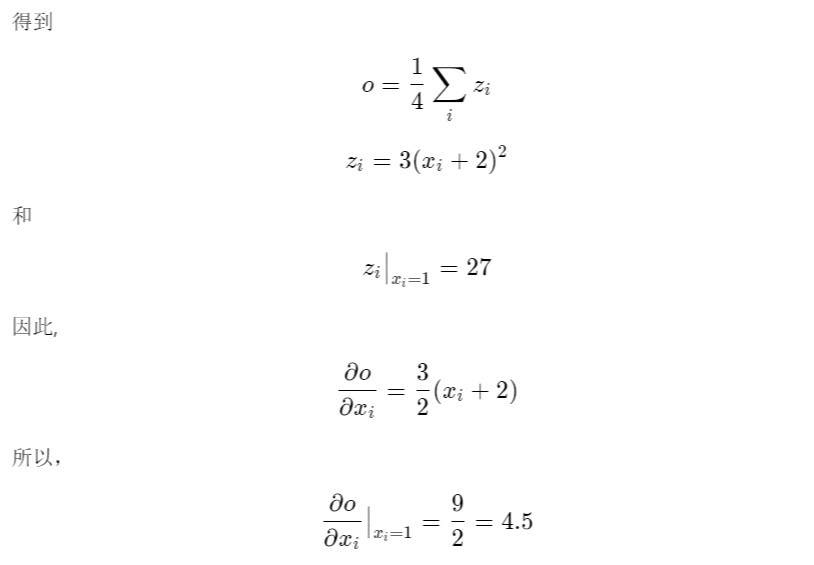
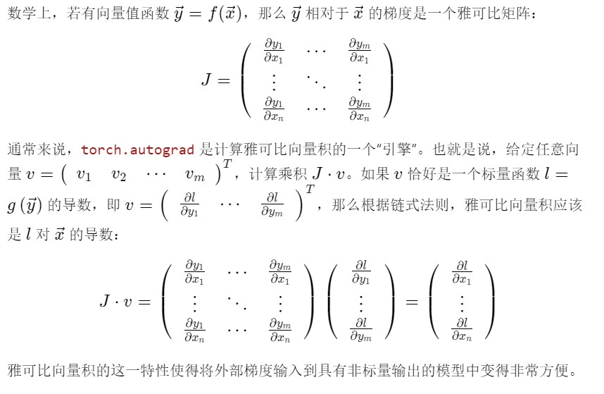

# Autograd：自动求导

> 译者：[bat67](https://github.com/bat67)
> 
> 最新版会在[译者仓库](https://github.com/bat67/Deep-Learning-with-PyTorch-A-60-Minute-Blitz-cn)首先同步。

PyTorch中，所有神经网络的核心是`autograd`包。先简单介绍一下这个包，然后训练我们的第一个的神经网络。

`autograd`包为张量上的所有操作提供了自动求导机制。它是一个在运行时定义（define-by-run）的框架，这意味着反向传播是根据代码如何运行来决定的，并且每次迭代可以是不同的.

让我们用一些简单的例子来看看吧。

## 张量

`torch.Tensor`是这个包的核心类。如果设置它的属性 `.requires_grad`为`True`，那么它将会追踪对于该张量的所有操作。当完成计算后可以通过调用`.backward()`，来自动计算所有的梯度。这个张量的所有梯度将会自动累加到`.grad`属性.

要阻止一个张量被跟踪历史，可以调用`.detach()`方法将其与计算历史分离，并阻止它未来的计算记录被跟踪。

为了防止跟踪历史记录（和使用内存），可以将代码块包装在`with torch.no_grad():`中。在评估模型时特别有用，因为模型可能具有`requires_grad = True`的可训练的参数，但是我们不需要在此过程中对他们进行梯度计算。

还有一个类对于autograd的实现非常重要：`Function`。

`Tensor`和`Function`互相连接生成了一个非循环图，它编码了完整的计算历史。每个张量都有一个`.grad_fn`属性，它引用了一个创建了这个`Tensor`的`Function`（除非这个张量是用户手动创建的，即这个张量的`grad_fn`是`None`）。

如果需要计算导数，可以在`Tensor`上调用`.backward()`。如果`Tensor`是一个标量（即它包含一个元素的数据），则不需要为`backward()`指定任何参数，但是如果它有更多的元素，则需要指定一个`gradient`参数，它是形状匹配的张量。


```python
import torch
```

创建一个张量并设置`requires_grad=True`用来追踪其计算历史

```python
x = torch.ones(2, 2, requires_grad=True)
print(x)
```

输出：

```python
tensor([[1., 1.],
        [1., 1.]], requires_grad=True)
```

对这个张量做一次运算：

```python
y = x + 2
print(y)
```

输出：

```python
tensor([[3., 3.],
        [3., 3.]], grad_fn=<AddBackward0>)
```

`y`是计算的结果，所以它有`grad_fn`属性。

```python
print(y.grad_fn)
```

输出：

```python
<AddBackward0 object at 0x7f1b248453c8>
```

对y进行更多操作

```python
z = y * y * 3
out = z.mean()

print(z, out)
```

输出：

```python
tensor([[27., 27.],
        [27., 27.]], grad_fn=<MulBackward0>) tensor(27., grad_fn=<MeanBackward0>)
```

`.requires_grad_(...)` 原地改变了现有张量的 `requires_grad` 标志。如果没有指定的话，默认输入的这个标志是`False`。

```python
a = torch.randn(2, 2)
a = ((a * 3) / (a - 1))
print(a.requires_grad)
a.requires_grad_(True)
print(a.requires_grad)
b = (a * a).sum()
print(b.grad_fn)
```

输出：

```python
False
True
<SumBackward0 object at 0x7f1b24845f98>
```

## 梯度

因为`out`是一个标量。所以让我们直接进行反向传播，`out.backward()`和`out.backward(torch.tensor(1.))`等价

```python
out.backward()
```

输出导数`d(out)/dx`

```python
print(x.grad)
```

输出：

```python
tensor([[4.5000, 4.5000],
        [4.5000, 4.5000]])
```

得到都是`4.5`的矩阵。调用`out`张量 $“o”$。

得到 

$$o = \frac{1}{4}\sum_i z_i$$

$$z_i = 3(x_i+2)^2$$

和

$$z_i\bigr\rvert_{x_i=1} = 27$$

因此,

$$\frac{\partial o}{\partial x_i} = \frac{3}{2}(x_i+2)$$

所以，

$$\frac{\partial o}{\partial x_i}\bigr\rvert_{x_i=1} = \frac{9}{2} = 4.5$$

数学上，若有向量值函数 $\vec{y}=f(\vec{x})$，那么 $\vec{y}$ 相对于 $\vec{x}$ 的梯度是一个雅可比矩阵：

$$
J=\left(\begin{array}{ccc}
   \frac{\partial y_{1}}{\partial x_{1}} & \cdots & \frac{\partial y_{m}}{\partial x_{1}}\\
   \vdots & \ddots & \vdots\\
   \frac{\partial y_{1}}{\partial x_{n}} & \cdots & \frac{\partial y_{m}}{\partial x_{n}}
   \end{array}\right)
$$

通常来说，`torch.autograd` 是计算雅可比向量积的一个“引擎”。也就是说，给定任意向量 $v=\left(\begin{array}{cccc} v_{1} & v_{2} & \cdots & v_{m}\end{array}\right)^{T}$，计算乘积 $J\cdot v$。如果 $v$ 恰好是一个标量函数 $l=g\left(\vec{y}\right)$ 的导数，即 $v=\left(\begin{array}{ccc}\frac{\partial l}{\partial y_{1}} & \cdots & \frac{\partial l}{\partial y_{m}}\end{array}\right)^{T}$，那么根据链式法则，雅可比向量积应该是 $l$ 对 $\vec{x}$ 的导数：

$$
J\cdot v=\left(\begin{array}{ccc}
   \frac{\partial y_{1}}{\partial x_{1}} & \cdots & \frac{\partial y_{m}}{\partial x_{1}}\\
   \vdots & \ddots & \vdots\\
   \frac{\partial y_{1}}{\partial x_{n}} & \cdots & \frac{\partial y_{m}}{\partial x_{n}}
   \end{array}\right)\left(\begin{array}{c}
   \frac{\partial l}{\partial y_{1}}\\
   \vdots\\
   \frac{\partial l}{\partial y_{m}}
   \end{array}\right)=\left(\begin{array}{c}
   \frac{\partial l}{\partial x_{1}}\\
   \vdots\\
   \frac{\partial l}{\partial x_{n}}
   \end{array}\right)
$$

> 若github无法显示公式，可以看下面两个截图：




雅可比向量积的这一特性使得将外部梯度输入到具有非标量输出的模型中变得非常方便。

现在我们来看一个雅可比向量积的例子:

```python
x = torch.randn(3, requires_grad=True)

y = x * 2
while y.data.norm() < 1000:
    y = y * 2

print(y)
```

输出：

```python
tensor([-278.6740,  935.4016,  439.6572], grad_fn=<MulBackward0>)
```

在这种情况下，`y`不再是标量。`torch.autograd`不能直接计算完整的雅可比矩阵，但是如果我们只想要雅可比向量积，只需将这个向量作为参数传给`backward`：


```python
v = torch.tensor([0.1, 1.0, 0.0001], dtype=torch.float)
y.backward(v)

print(x.grad)
```

输出：

```python
tensor([4.0960e+02, 4.0960e+03, 4.0960e-01])
```

为了防止跟踪历史记录（和使用内存），可以将代码块包装在`with torch.no_grad():`中。在评估模型时特别有用，因为模型可能具有`requires_grad = True`的可训练的参数，但是我们不需要在此过程中对他们进行梯度计算。

也可以通过将代码块包装在 `with torch.no_grad():` 中，来阻止autograd跟踪设置了 `.requires_grad=True` 的张量的历史记录。


```python
print(x.requires_grad)
print((x ** 2).requires_grad)

with torch.no_grad():
    print((x ** 2).requires_grad)
```

输出：

```python
True
True
False
```

> 后续阅读：
> 
> `autograd`和`Function`的文档见：https://pytorch.org/docs/autograd
