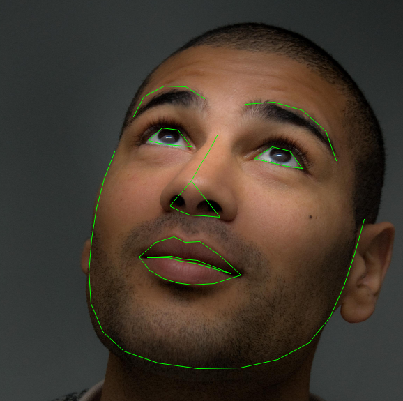
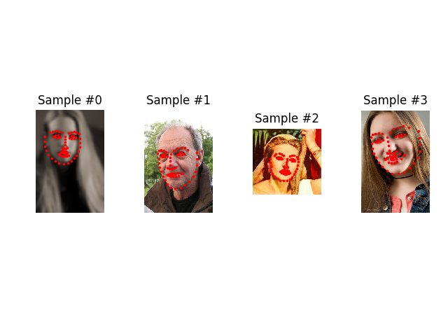
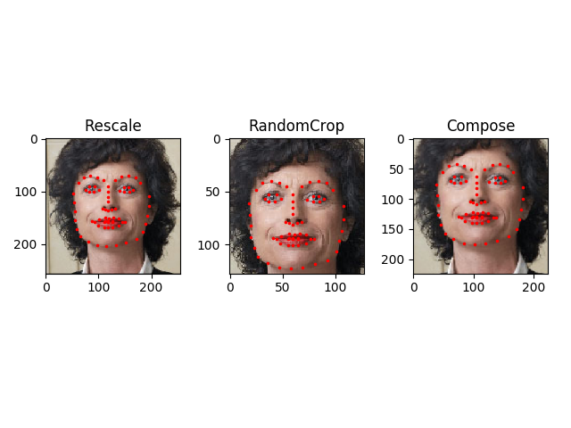

# 数据加载和处理教程

> 译者：[yportne13](https://github.com/yportne13)

**作者**：[Sasank Chilamkurthy](https://chsasank.github.io)

在解决机器学习问题的时候，人们花了大量精力准备数据。pytorch提供了许多工具来让载入数据更简单并尽量让你的代码的可读性更高。在这篇教程中，我们将从一个容易处理的数据集中学习如何加载和预处理/增强数据。

在运行这个教程前请先确保你已安装以下的包:

*   `scikit-image`: 图形接口以及变换
*   `pandas`: 便于处理csv文件

```py
from __future__ import print_function, division
import os
import torch
import pandas as pd
from skimage import io, transform
import numpy as np
import matplotlib.pyplot as plt
from torch.utils.data import Dataset, DataLoader
from torchvision import transforms, utils

# Ignore warnings
import warnings
warnings.filterwarnings("ignore")

plt.ion()   # interactive mode

```

我们要处理的是一个面部姿态的数据集。也就是按如下方式标注的人脸:

[](https://pytorch.org/tutorials/_images/landmarked_face2.png)

每张脸标注了68个不同的特征点。

注意

从[这里](https://download.pytorch.org/tutorial/faces.zip)下载数据集并把它放置在 ‘data/faces/’路径下。这个数据集实际上是对ImageNet中的人脸图像使用表现出色的DLIB姿势估计模型([dlib’s pose estimation](https://blog.dlib.net/2014/08/real-time-face-pose-estimation.html)) 生成的。

数据集是按如下规则打包成的csv文件:

```py
image_name,part_0_x,part_0_y,part_1_x,part_1_y,part_2_x, ... ,part_67_x,part_67_y
0805personali01.jpg,27,83,27,98, ... 84,134
1084239450_e76e00b7e7.jpg,70,236,71,257, ... ,128,312

```

将csv中的标注点数据读入（N，2）数组中，其中N是特征点的数量。

```py
landmarks_frame = pd.read_csv('data/faces/face_landmarks.csv')

n = 65
img_name = landmarks_frame.iloc[n, 0]
landmarks = landmarks_frame.iloc[n, 1:].as_matrix()
landmarks = landmarks.astype('float').reshape(-1, 2)

print('Image name: {}'.format(img_name))
print('Landmarks shape: {}'.format(landmarks.shape))
print('First 4 Landmarks: {}'.format(landmarks[:4]))

```

输出:

```py
Image name: person-7.jpg
Landmarks shape: (68, 2)
First 4 Landmarks: [[32\. 65.]
 [33\. 76.]
 [34\. 86.]
 [34\. 97.]]

```

写一个简单的函数来展示一张图片和它对应的标注点作为例子。

```py
def show_landmarks(image, landmarks):
    """Show image with landmarks"""
    plt.imshow(image)
    plt.scatter(landmarks[:, 0], landmarks[:, 1], s=10, marker='.', c='r')
    plt.pause(0.001)  # pause a bit so that plots are updated

plt.figure()
show_landmarks(io.imread(os.path.join('data/faces/', img_name)),
               landmarks)
plt.show()

```


## 数据集类 Dataset class

`torch.utils.data.Dataset` 是一个代表数据集的抽象类。你自定的数据集类应该继承自 `Dataset` 类并重新实现以下方法:

*   `__len__` 实现 `len(dataset)` 返还数据集的尺寸。
*   `__getitem__` 用来获取一些索引数据，例如 `dataset[i]` 中的 $$i$$。

让我们来为我们的数据集创建一个类。我们将在 `__init__` 中读取csv的文件内容，在 `__getitem__`中读取图片。这么做是为了节省内存空间。只有在需要用到图片的时候才读取它而不是一开始就把图片全部存进内存里。

我们的数据样本将按这样一个字典 `{'image': image, 'landmarks': landmarks}`组织。 我们的数据集类将添加一个可选参数 `transform` 以方便对样本进行预处理。下一节我们会看到什么时候需要用到 `transform` 参数。

```py
class FaceLandmarksDataset(Dataset):
    """Face Landmarks dataset."""

    def __init__(self, csv_file, root_dir, transform=None):
        """
 Args:
 csv_file (string): Path to the csv file with annotations.
 root_dir (string): Directory with all the images.
 transform (callable, optional): Optional transform to be applied
 on a sample.
 """
        self.landmarks_frame = pd.read_csv(csv_file)
        self.root_dir = root_dir
        self.transform = transform

    def __len__(self):
        return len(self.landmarks_frame)

    def __getitem__(self, idx):
        img_name = os.path.join(self.root_dir,
                                self.landmarks_frame.iloc[idx, 0])
        image = io.imread(img_name)
        landmarks = self.landmarks_frame.iloc[idx, 1:].as_matrix()
        landmarks = landmarks.astype('float').reshape(-1, 2)
        sample = {'image': image, 'landmarks': landmarks}

        if self.transform:
            sample = self.transform(sample)

        return sample

```

让我们实例化这个类并创建几个数据。我们将会打印出前四个例子的尺寸并展示标注的特征点。

```py
face_dataset = FaceLandmarksDataset(csv_file='data/faces/face_landmarks.csv',
                                    root_dir='data/faces/')

fig = plt.figure()

for i in range(len(face_dataset)):
    sample = face_dataset[i]

    print(i, sample['image'].shape, sample['landmarks'].shape)

    ax = plt.subplot(1, 4, i + 1)
    plt.tight_layout()
    ax.set_title('Sample #{}'.format(i))
    ax.axis('off')
    show_landmarks(**sample)

    if i == 3:
        plt.show()
        break

```



输出:

```py
0 (324, 215, 3) (68, 2)
1 (500, 333, 3) (68, 2)
2 (250, 258, 3) (68, 2)
3 (434, 290, 3) (68, 2)

```

## 转换 Transforms

通过上面的例子我们会发现图片并不是同样的尺寸。绝大多数神经网络都假定图片的尺寸相同。因此我们需要做一些预处理。让我们创建三个转换:

*   `Rescale`: 缩放图片
*   `RandomCrop`: 对图片进行随机裁剪。这是一种数据增强操作
*   `ToTensor`: 把 numpy 格式图片转为 torch 格式图片 (我们需要交换坐标轴).

我们会把它们写成可调用的类的形式而不是简单的函数，这样就不需要每次调用时传递一遍参数。我们只需要实现 `__call__` 方法，必要的时候实现 `__init__` 方法。我们可以这样调用这些转换:

```py
tsfm = Transform(params)
transformed_sample = tsfm(sample)

```

观察下面这些转换是如何应用在图像和标签上的。

```py
class Rescale(object):
    """Rescale the image in a sample to a given size.

 Args:
 output_size (tuple or int): Desired output size. If tuple, output is
 matched to output_size. If int, smaller of image edges is matched
 to output_size keeping aspect ratio the same.
 """

    def __init__(self, output_size):
        assert isinstance(output_size, (int, tuple))
        self.output_size = output_size

    def __call__(self, sample):
        image, landmarks = sample['image'], sample['landmarks']

        h, w = image.shape[:2]
        if isinstance(self.output_size, int):
            if h > w:
                new_h, new_w = self.output_size * h / w, self.output_size
            else:
                new_h, new_w = self.output_size, self.output_size * w / h
        else:
            new_h, new_w = self.output_size

        new_h, new_w = int(new_h), int(new_w)

        img = transform.resize(image, (new_h, new_w))

        # h and w are swapped for landmarks because for images,
        # x and y axes are axis 1 and 0 respectively
        landmarks = landmarks * [new_w / w, new_h / h]

        return {'image': img, 'landmarks': landmarks}

class RandomCrop(object):
    """Crop randomly the image in a sample.

 Args:
 output_size (tuple or int): Desired output size. If int, square crop
 is made.
 """

    def __init__(self, output_size):
        assert isinstance(output_size, (int, tuple))
        if isinstance(output_size, int):
            self.output_size = (output_size, output_size)
        else:
            assert len(output_size) == 2
            self.output_size = output_size

    def __call__(self, sample):
        image, landmarks = sample['image'], sample['landmarks']

        h, w = image.shape[:2]
        new_h, new_w = self.output_size

        top = np.random.randint(0, h - new_h)
        left = np.random.randint(0, w - new_w)

        image = image[top: top + new_h,
                      left: left + new_w]

        landmarks = landmarks - [left, top]

        return {'image': image, 'landmarks': landmarks}

class ToTensor(object):
    """Convert ndarrays in sample to Tensors."""

    def __call__(self, sample):
        image, landmarks = sample['image'], sample['landmarks']

        # swap color axis because
        # numpy image: H x W x C
        # torch image: C X H X W
        image = image.transpose((2, 0, 1))
        return {'image': torch.from_numpy(image),
                'landmarks': torch.from_numpy(landmarks)}

```

### 组合转换 Compose transforms

接下来我们把这些转换应用到一个例子上。

我们想要把图像的短边调整为256，然后随机裁剪 (randomcrop) 为224大小的正方形。也就是说，我们打算组合一个 `Rescale` 和 `RandomCrop` 的变换。 我们可以调用一个简单的类 `torchvision.transforms.Compose` 来实现这一操作。

```py
scale = Rescale(256)
crop = RandomCrop(128)
composed = transforms.Compose([Rescale(256),
                               RandomCrop(224)])

# Apply each of the above transforms on sample.
fig = plt.figure()
sample = face_dataset[65]
for i, tsfrm in enumerate([scale, crop, composed]):
    transformed_sample = tsfrm(sample)

    ax = plt.subplot(1, 3, i + 1)
    plt.tight_layout()
    ax.set_title(type(tsfrm).__name__)
    show_landmarks(**transformed_sample)

plt.show()

```



## 迭代数据集 Iterating through the dataset

让我们把这些整合起来以创建一个带组合转换的数据集。 总结一下，每次这个数据集被采样时:

*   及时地从文件中读取图片
*   对读取的图片应用转换
*   由于其中一步操作是随机的 (randomcrop) , 数据被增强了

我们可以像之前那样使用 `for i in range` 循环来对所有创建的数据集执行同样的操作。

```py
transformed_dataset = FaceLandmarksDataset(csv_file='data/faces/face_landmarks.csv',
                                           root_dir='data/faces/',
                                           transform=transforms.Compose([
                                               Rescale(256),
                                               RandomCrop(224),
                                               ToTensor()
                                           ]))

for i in range(len(transformed_dataset)):
    sample = transformed_dataset[i]

    print(i, sample['image'].size(), sample['landmarks'].size())

    if i == 3:
        break

```

输出:

```py
0 torch.Size([3, 224, 224]) torch.Size([68, 2])
1 torch.Size([3, 224, 224]) torch.Size([68, 2])
2 torch.Size([3, 224, 224]) torch.Size([68, 2])
3 torch.Size([3, 224, 224]) torch.Size([68, 2])

```

但是，对所有数据集简单的使用 `for` 循环牺牲了许多功能，尤其是:

*   批处理数据（Batching the data）
*   打乱数据（Shuffling the data）
*   使用多线程 `multiprocessing` 并行加载数据。

`torch.utils.data.DataLoader` 这个迭代器提供了以上所有功能。 下面使用的参数必须是清楚的。 一个值得关注的参数是 `collate_fn`. 你可以通过 `collate_fn` 来决定如何对数据进行批处理。 但是绝大多数情况下默认值就能运行良好。

```py
dataloader = DataLoader(transformed_dataset, batch_size=4,
                        shuffle=True, num_workers=4)

# Helper function to show a batch
def show_landmarks_batch(sample_batched):
    """Show image with landmarks for a batch of samples."""
    images_batch, landmarks_batch = \
            sample_batched['image'], sample_batched['landmarks']
    batch_size = len(images_batch)
    im_size = images_batch.size(2)

    grid = utils.make_grid(images_batch)
    plt.imshow(grid.numpy().transpose((1, 2, 0)))

    for i in range(batch_size):
        plt.scatter(landmarks_batch[i, :, 0].numpy() + i * im_size,
                    landmarks_batch[i, :, 1].numpy(),
                    s=10, marker='.', c='r')

        plt.title('Batch from dataloader')

for i_batch, sample_batched in enumerate(dataloader):
    print(i_batch, sample_batched['image'].size(),
          sample_batched['landmarks'].size())

    # observe 4th batch and stop.
    if i_batch == 3:
        plt.figure()
        show_landmarks_batch(sample_batched)
        plt.axis('off')
        plt.ioff()
        plt.show()
        break

```


输出:

```py
0 torch.Size([4, 3, 224, 224]) torch.Size([4, 68, 2])
1 torch.Size([4, 3, 224, 224]) torch.Size([4, 68, 2])
2 torch.Size([4, 3, 224, 224]) torch.Size([4, 68, 2])
3 torch.Size([4, 3, 224, 224]) torch.Size([4, 68, 2])

```

## 后记: torchvision

在这篇教程中我们学习了如何构造和使用数据集类 (datasets), 转换 (transforms) 和数据加载器 (dataloader)。 `torchvision` 包提供了常用的数据集类 (datasets) 和转换 (transforms)。  你可能不需要自己构造这些类。 torchvision 中还有一个更常用的数据集类 `ImageFolder`. 它假定了数据集是以如下方式构造的:

```py
root/ants/xxx.png
root/ants/xxy.jpeg
root/ants/xxz.png
.
.
.
root/bees/123.jpg
root/bees/nsdf3.png
root/bees/asd932_.png

```

其中 ‘ants’, ‘bees’ 等是分类标签。 在 `PIL.Image` 中你也可以使用类似的转换 (transforms) 例如 `RandomHorizontalFlip`, `Scale`。利用这些你可以按如下的方式创建一个数据加载器 (dataloader) :

```py
import torch
from torchvision import transforms, datasets

data_transform = transforms.Compose([
        transforms.RandomSizedCrop(224),
        transforms.RandomHorizontalFlip(),
        transforms.ToTensor(),
        transforms.Normalize(mean=[0.485, 0.456, 0.406],
                             std=[0.229, 0.224, 0.225])
    ])
hymenoptera_dataset = datasets.ImageFolder(root='hymenoptera_data/train',
                                           transform=data_transform)
dataset_loader = torch.utils.data.DataLoader(hymenoptera_dataset,
                                             batch_size=4, shuffle=True,
                                             num_workers=4)

```

带训练部分的例程可以参考这里 [Transfer Learning Tutorial](transfer_learning_tutorial.html).
