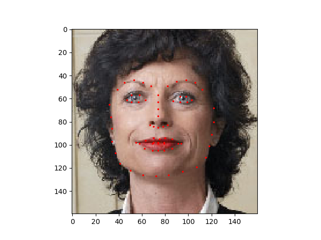
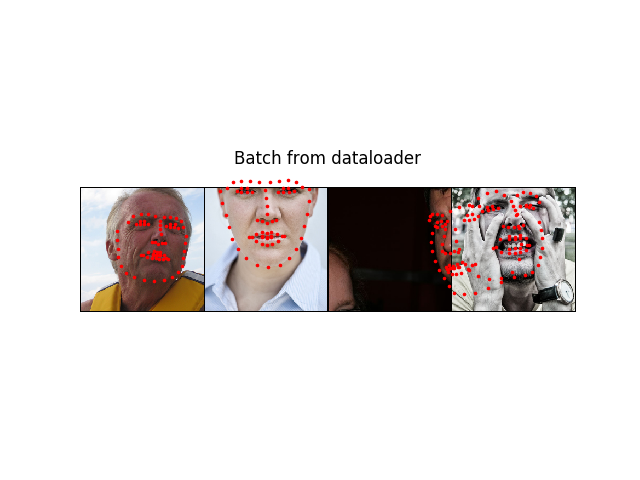

# Data Loading and Processing Tutorial

**Author**: [Sasank Chilamkurthy](https://chsasank.github.io)

A lot of effort in solving any machine learning problem goes in to preparing the data. PyTorch provides many tools to make data loading easy and hopefully, to make your code more readable. In this tutorial, we will see how to load and preprocess/augment data from a non trivial dataset.

To run this tutorial, please make sure the following packages are installed:

*   `scikit-image`: For image io and transforms
*   `pandas`: For easier csv parsing

```py
from __future__ import print_function, division
import os
import torch
import pandas as pd
from skimage import io, transform
import numpy as np
import matplotlib.pyplot as plt
from torch.utils.data import Dataset, DataLoader
from torchvision import transforms, utils

# Ignore warnings
import warnings
warnings.filterwarnings("ignore")

plt.ion()   # interactive mode

```

The dataset we are going to deal with is that of facial pose. This means that a face is annotated like this:

[](https://pytorch.org/tutorials/_images/landmarked_face2.png)

Over all, 68 different landmark points are annotated for each face.

Note

Download the dataset from [here](https://download.pytorch.org/tutorial/faces.zip) so that the images are in a directory named ‘data/faces/’. This dataset was actually generated by applying excellent [dlib’s pose estimation](https://blog.dlib.net/2014/08/real-time-face-pose-estimation.html) on a few images from imagenet tagged as ‘face’.

Dataset comes with a csv file with annotations which looks like this:

```py
image_name,part_0_x,part_0_y,part_1_x,part_1_y,part_2_x, ... ,part_67_x,part_67_y
0805personali01.jpg,27,83,27,98, ... 84,134
1084239450_e76e00b7e7.jpg,70,236,71,257, ... ,128,312

```

Let’s quickly read the CSV and get the annotations in an (N, 2) array where N is the number of landmarks.

```py
landmarks_frame = pd.read_csv('data/faces/face_landmarks.csv')

n = 65
img_name = landmarks_frame.iloc[n, 0]
landmarks = landmarks_frame.iloc[n, 1:].as_matrix()
landmarks = landmarks.astype('float').reshape(-1, 2)

print('Image name: {}'.format(img_name))
print('Landmarks shape: {}'.format(landmarks.shape))
print('First 4 Landmarks: {}'.format(landmarks[:4]))

```

Out:

```py
Image name: person-7.jpg
Landmarks shape: (68, 2)
First 4 Landmarks: [[32\. 65.]
 [33\. 76.]
 [34\. 86.]
 [34\. 97.]]

```

Let’s write a simple helper function to show an image and its landmarks and use it to show a sample.

```py
def show_landmarks(image, landmarks):
    """Show image with landmarks"""
    plt.imshow(image)
    plt.scatter(landmarks[:, 0], landmarks[:, 1], s=10, marker='.', c='r')
    plt.pause(0.001)  # pause a bit so that plots are updated

plt.figure()
show_landmarks(io.imread(os.path.join('data/faces/', img_name)),
               landmarks)
plt.show()

```



## Dataset class

`torch.utils.data.Dataset` is an abstract class representing a dataset. Your custom dataset should inherit `Dataset` and override the following methods:

*   `__len__` so that `len(dataset)` returns the size of the dataset.
*   `__getitem__` to support the indexing such that `dataset[i]` can be used to get `\(i\)`th sample

Let’s create a dataset class for our face landmarks dataset. We will read the csv in `__init__` but leave the reading of images to `__getitem__`. This is memory efficient because all the images are not stored in the memory at once but read as required.

Sample of our dataset will be a dict `{'image': image, 'landmarks': landmarks}`. Our datset will take an optional argument `transform` so that any required processing can be applied on the sample. We will see the usefulness of `transform` in the next section.

```py
class FaceLandmarksDataset(Dataset):
    """Face Landmarks dataset."""

    def __init__(self, csv_file, root_dir, transform=None):
        """
 Args:
 csv_file (string): Path to the csv file with annotations.
 root_dir (string): Directory with all the images.
 transform (callable, optional): Optional transform to be applied
 on a sample.
 """
        self.landmarks_frame = pd.read_csv(csv_file)
        self.root_dir = root_dir
        self.transform = transform

    def __len__(self):
        return len(self.landmarks_frame)

    def __getitem__(self, idx):
        img_name = os.path.join(self.root_dir,
                                self.landmarks_frame.iloc[idx, 0])
        image = io.imread(img_name)
        landmarks = self.landmarks_frame.iloc[idx, 1:].as_matrix()
        landmarks = landmarks.astype('float').reshape(-1, 2)
        sample = {'image': image, 'landmarks': landmarks}

        if self.transform:
            sample = self.transform(sample)

        return sample

```

Let’s instantiate this class and iterate through the data samples. We will print the sizes of first 4 samples and show their landmarks.

```py
face_dataset = FaceLandmarksDataset(csv_file='data/faces/face_landmarks.csv',
                                    root_dir='data/faces/')

fig = plt.figure()

for i in range(len(face_dataset)):
    sample = face_dataset[i]

    print(i, sample['image'].shape, sample['landmarks'].shape)

    ax = plt.subplot(1, 4, i + 1)
    plt.tight_layout()
    ax.set_title('Sample #{}'.format(i))
    ax.axis('off')
    show_landmarks(**sample)

    if i == 3:
        plt.show()
        break

```


Out:

```py
0 (324, 215, 3) (68, 2)
1 (500, 333, 3) (68, 2)
2 (250, 258, 3) (68, 2)
3 (434, 290, 3) (68, 2)

```

## Transforms

One issue we can see from the above is that the samples are not of the same size. Most neural networks expect the images of a fixed size. Therefore, we will need to write some prepocessing code. Let’s create three transforms:

*   `Rescale`: to scale the image
*   `RandomCrop`: to crop from image randomly. This is data augmentation.
*   `ToTensor`: to convert the numpy images to torch images (we need to swap axes).

We will write them as callable classes instead of simple functions so that parameters of the transform need not be passed everytime it’s called. For this, we just need to implement `__call__` method and if required, `__init__` method. We can then use a transform like this:

```py
tsfm = Transform(params)
transformed_sample = tsfm(sample)

```

Observe below how these transforms had to be applied both on the image and landmarks.

```py
class Rescale(object):
    """Rescale the image in a sample to a given size.

 Args:
 output_size (tuple or int): Desired output size. If tuple, output is
 matched to output_size. If int, smaller of image edges is matched
 to output_size keeping aspect ratio the same.
 """

    def __init__(self, output_size):
        assert isinstance(output_size, (int, tuple))
        self.output_size = output_size

    def __call__(self, sample):
        image, landmarks = sample['image'], sample['landmarks']

        h, w = image.shape[:2]
        if isinstance(self.output_size, int):
            if h > w:
                new_h, new_w = self.output_size * h / w, self.output_size
            else:
                new_h, new_w = self.output_size, self.output_size * w / h
        else:
            new_h, new_w = self.output_size

        new_h, new_w = int(new_h), int(new_w)

        img = transform.resize(image, (new_h, new_w))

        # h and w are swapped for landmarks because for images,
        # x and y axes are axis 1 and 0 respectively
        landmarks = landmarks * [new_w / w, new_h / h]

        return {'image': img, 'landmarks': landmarks}

class RandomCrop(object):
    """Crop randomly the image in a sample.

 Args:
 output_size (tuple or int): Desired output size. If int, square crop
 is made.
 """

    def __init__(self, output_size):
        assert isinstance(output_size, (int, tuple))
        if isinstance(output_size, int):
            self.output_size = (output_size, output_size)
        else:
            assert len(output_size) == 2
            self.output_size = output_size

    def __call__(self, sample):
        image, landmarks = sample['image'], sample['landmarks']

        h, w = image.shape[:2]
        new_h, new_w = self.output_size

        top = np.random.randint(0, h - new_h)
        left = np.random.randint(0, w - new_w)

        image = image[top: top + new_h,
                      left: left + new_w]

        landmarks = landmarks - [left, top]

        return {'image': image, 'landmarks': landmarks}

class ToTensor(object):
    """Convert ndarrays in sample to Tensors."""

    def __call__(self, sample):
        image, landmarks = sample['image'], sample['landmarks']

        # swap color axis because
        # numpy image: H x W x C
        # torch image: C X H X W
        image = image.transpose((2, 0, 1))
        return {'image': torch.from_numpy(image),
                'landmarks': torch.from_numpy(landmarks)}

```

### Compose transforms

Now, we apply the transforms on an sample.

Let’s say we want to rescale the shorter side of the image to 256 and then randomly crop a square of size 224 from it. i.e, we want to compose `Rescale` and `RandomCrop` transforms. `torchvision.transforms.Compose` is a simple callable class which allows us to do this.

```py
scale = Rescale(256)
crop = RandomCrop(128)
composed = transforms.Compose([Rescale(256),
                               RandomCrop(224)])

# Apply each of the above transforms on sample.
fig = plt.figure()
sample = face_dataset[65]
for i, tsfrm in enumerate([scale, crop, composed]):
    transformed_sample = tsfrm(sample)

    ax = plt.subplot(1, 3, i + 1)
    plt.tight_layout()
    ax.set_title(type(tsfrm).__name__)
    show_landmarks(**transformed_sample)

plt.show()

```


## Iterating through the dataset

Let’s put this all together to create a dataset with composed transforms. To summarize, every time this dataset is sampled:

*   An image is read from the file on the fly
*   Transforms are applied on the read image
*   Since one of the transforms is random, data is augmentated on sampling

We can iterate over the created dataset with a `for i in range` loop as before.

```py
transformed_dataset = FaceLandmarksDataset(csv_file='data/faces/face_landmarks.csv',
                                           root_dir='data/faces/',
                                           transform=transforms.Compose([
                                               Rescale(256),
                                               RandomCrop(224),
                                               ToTensor()
                                           ]))

for i in range(len(transformed_dataset)):
    sample = transformed_dataset[i]

    print(i, sample['image'].size(), sample['landmarks'].size())

    if i == 3:
        break

```

Out:

```py
0 torch.Size([3, 224, 224]) torch.Size([68, 2])
1 torch.Size([3, 224, 224]) torch.Size([68, 2])
2 torch.Size([3, 224, 224]) torch.Size([68, 2])
3 torch.Size([3, 224, 224]) torch.Size([68, 2])

```

However, we are losing a lot of features by using a simple `for` loop to iterate over the data. In particular, we are missing out on:

*   Batching the data
*   Shuffling the data
*   Load the data in parallel using `multiprocessing` workers.

`torch.utils.data.DataLoader` is an iterator which provides all these features. Parameters used below should be clear. One parameter of interest is `collate_fn`. You can specify how exactly the samples need to be batched using `collate_fn`. However, default collate should work fine for most use cases.

```py
dataloader = DataLoader(transformed_dataset, batch_size=4,
                        shuffle=True, num_workers=4)

# Helper function to show a batch
def show_landmarks_batch(sample_batched):
    """Show image with landmarks for a batch of samples."""
    images_batch, landmarks_batch = \
            sample_batched['image'], sample_batched['landmarks']
    batch_size = len(images_batch)
    im_size = images_batch.size(2)

    grid = utils.make_grid(images_batch)
    plt.imshow(grid.numpy().transpose((1, 2, 0)))

    for i in range(batch_size):
        plt.scatter(landmarks_batch[i, :, 0].numpy() + i * im_size,
                    landmarks_batch[i, :, 1].numpy(),
                    s=10, marker='.', c='r')

        plt.title('Batch from dataloader')

for i_batch, sample_batched in enumerate(dataloader):
    print(i_batch, sample_batched['image'].size(),
          sample_batched['landmarks'].size())

    # observe 4th batch and stop.
    if i_batch == 3:
        plt.figure()
        show_landmarks_batch(sample_batched)
        plt.axis('off')
        plt.ioff()
        plt.show()
        break

```



Out:

```py
0 torch.Size([4, 3, 224, 224]) torch.Size([4, 68, 2])
1 torch.Size([4, 3, 224, 224]) torch.Size([4, 68, 2])
2 torch.Size([4, 3, 224, 224]) torch.Size([4, 68, 2])
3 torch.Size([4, 3, 224, 224]) torch.Size([4, 68, 2])

```

## Afterword: torchvision

In this tutorial, we have seen how to write and use datasets, transforms and dataloader. `torchvision` package provides some common datasets and transforms. You might not even have to write custom classes. One of the more generic datasets available in torchvision is `ImageFolder`. It assumes that images are organized in the following way:

```py
root/ants/xxx.png
root/ants/xxy.jpeg
root/ants/xxz.png
.
.
.
root/bees/123.jpg
root/bees/nsdf3.png
root/bees/asd932_.png

```

where ‘ants’, ‘bees’ etc. are class labels. Similarly generic transforms which operate on `PIL.Image` like `RandomHorizontalFlip`, `Scale`, are also available. You can use these to write a dataloader like this:

```py
import torch
from torchvision import transforms, datasets

data_transform = transforms.Compose([
        transforms.RandomSizedCrop(224),
        transforms.RandomHorizontalFlip(),
        transforms.ToTensor(),
        transforms.Normalize(mean=[0.485, 0.456, 0.406],
                             std=[0.229, 0.224, 0.225])
    ])
hymenoptera_dataset = datasets.ImageFolder(root='hymenoptera_data/train',
                                           transform=data_transform)
dataset_loader = torch.utils.data.DataLoader(hymenoptera_dataset,
                                             batch_size=4, shuffle=True,
                                             num_workers=4)

```

For an example with training code, please see [Transfer Learning Tutorial](transfer_learning_tutorial.html).

**Total running time of the script:** ( 0 minutes 58.325 seconds)

[`Download Python source code: data_loading_tutorial.py`](../_downloads/0daab3cdf9be9579bd736e92d8de3917/data_loading_tutorial.py)[`Download Jupyter notebook: data_loading_tutorial.ipynb`](../_downloads/21adbaecd47a412f8143afb1c48f05a6/data_loading_tutorial.ipynb)

[Gallery generated by Sphinx-Gallery](https://sphinx-gallery.readthedocs.io)

