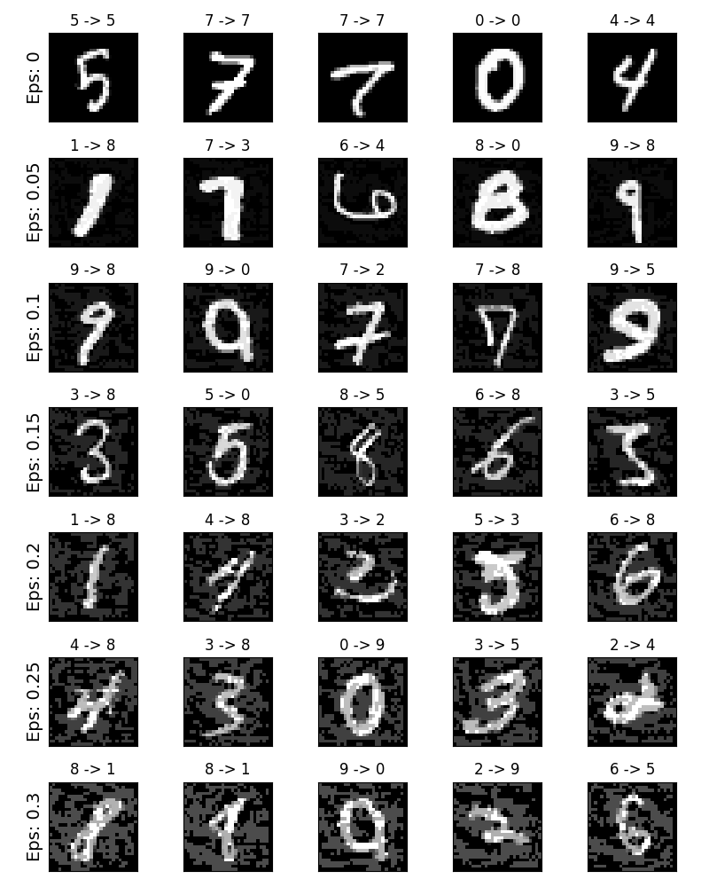

# 设计对抗性用例

**Author:** [Nathan Inkawhich](https://github.com/inkawhich)

如果你正在阅读这篇文章，希望你能理解一些机器学习模型是多么有效。现在的研究正在不断推动ML模型变得更快、更准确和更高效。然而，在设计和训练模型中经常会忽视的是安全性和健壮性方面，特别是在面对欺骗模型的对手时。

本教程将提高您对ML模型安全漏洞的认识，并将深入探讨对抗性机器学习这一热门话题。您可能会惊讶地发现，在图像中添加细微的干扰会导致模型性能的巨大差异。鉴于这是一个教程，我们将通过一个图像分类器上的示例来探索这个主题。具体来说，我们将使用第一个也是最流行的攻击方法之一，快速梯度符号攻击`Fast Gradient Sign Attack`(FGSM)，以欺骗一个MNIST分类器。

## 威胁模型

就上下文而言，有许多类型的对抗性攻击，每一类攻击都有不同的目标和对攻击者知识的假设。然而，总的目标是在输入数据中添加最少的扰动，以导致所需的错误分类。攻击者的知识有几种假设，其中两种是:**白盒**和**黑盒**。白盒攻击假定攻击者具有对模型的全部知识和访问权，包括体系结构、输入、输出和权重。黑盒攻击假设攻击者只访问模型的输入和输出，对底层架构或权重一无所知。目标也有几种类型，包括**错误分类**和**源/目标错误分类**。错误分类的目标意味着对手只希望输出分类是错误的，而不关心新的分类是什么。源/目标错误分类意味着对手想要更改原来属于特定源类的图像，以便将其分类为特定的目标类。

在这种情况下，FGSM攻击是一种以错误分类为目标的白盒攻击。有了这些背景信息，我们现在可以详细讨论攻击。

## 快速梯度符号攻击

到目前为止，最早也是最流行的对抗性攻击之一被称为快速梯度符号攻击(FGSM)，由Goodfellow等人在解释和利用对抗性示例(  [Explaining and Harnessing Adversarial Examples](https://arxiv.org/abs/1412.6572))时介绍到。这种攻击非常强大，而且直观。它被设计用来攻击神经网络，利用他们学习的方式，梯度`gradients`。这个想法很简单，比起根据后向传播梯度来调整权重使损失最小化，这种攻击是根据相同的反向传播梯度调整输入数据来最大化损失。换句话说，攻击使用了输入数据相关的梯度损失方式，通过调整输入数据，使损失最大化。

在我们深入代码之前，让我们看看著名的[FGSM](https://arxiv.org/abs/1412.6572)  panda示例并提取一些符号。


从图像中看，`\(\mathbf{x}\)` 是一个正确分类为“熊猫”(panda)的原始输入图像， `\(y\)` 是对`\(\mathbf{x}\)`的真实表征标签`ground truth label `, `\(\mathbf{\theta}\)` 表示模型参数， 而 `\(J(\mathbf{\theta}, \mathbf{x}, y)\)` 是用来训练网络的损失函数。 这种攻击将梯度后向传播到输入数据来计算 `\(\nabla_{x} J(\mathbf{\theta}, \mathbf{x}, y)\)`。然后将输入数据通过一小步(`\(\epsilon\)` 或 如图中的`\(0.007\)` ) 在(i.e. `\(sign(\nabla_{x} J(\mathbf{\theta}, \mathbf{x}, y))\)`) 方向上调整，使损失最大化。结果将得到受到干扰的图像， `\(x'\)`，尽管图片还是“熊猫”，但它一杯目标网络错误分类为“长臂猿”(gibbon)了

希望看到现在的你，已经明确了解了本教程的动机，那么，让我们开始实现它吧。

```python
from __future__ import print_function
import torch
import torch.nn as nn
import torch.nn.functional as F
import torch.optim as optim
from torchvision import datasets, transforms
import numpy as np
import matplotlib.pyplot as plt

```

## 实现

在本节中，我们将讨论本教程的输入参数，定义受攻击的模型，然后编写攻击代码并运行一些测试。

### 输入

本教程只有三个输入，定义如下:

*   **epsilons** - 要用于运行的epsilon值的列表。在列表中保留0是很重要的，因为它代表了原始测试集上的模型性能。而且，直觉上我们认为，epsilon越大，扰动越明显，但在降低模型精度方面攻击越有效。因为这里的数据范围是 `\([0,1]\)`，所以取值不应该超过1。
*   **pretrained_model** - 表示使用 [pytorch/examples/mnist](https://github.com/pytorch/examples/tree/master/mnist)进行训练的预训练MNIST模型的路径。为了简单起见，在这里 [下载](https://drive.google.com/drive/folders/1fn83DF14tWmit0RTKWRhPq5uVXt73e0h?usp=sharing)预先训练的模型。
*   **use_cuda** - 如果需要和可用，使用CUDA的布尔标志。注意，带有CUDA的GPU对于本教程来说并不重要，因为CPU不会占用太多时间。

```python
epsilons = [0, .05, .1, .15, .2, .25, .3]
pretrained_model = "data/lenet_mnist_model.pth"
use_cuda=True

```

### 受攻模型

如前所述，受攻模型与[pytorch/examples/mnist](https://github.com/pytorch/examples/tree/master/mnist)中的MNIST模型相同。您可以培训并保存自己的MNIST模型，也可以下载并使用提供的模型。这里的Net定义和测试dataloader是从MNIST示例中复制的。本节的目的是定义模型和加载数据，然后初始化模型并加载预先训练的权重。

```python
# LeNet Model definition
class Net(nn.Module):
    def __init__(self):
        super(Net, self).__init__()
        self.conv1 = nn.Conv2d(1, 10, kernel_size=5)
        self.conv2 = nn.Conv2d(10, 20, kernel_size=5)
        self.conv2_drop = nn.Dropout2d()
        self.fc1 = nn.Linear(320, 50)
        self.fc2 = nn.Linear(50, 10)

    def forward(self, x):
        x = F.relu(F.max_pool2d(self.conv1(x), 2))
        x = F.relu(F.max_pool2d(self.conv2_drop(self.conv2(x)), 2))
        x = x.view(-1, 320)
        x = F.relu(self.fc1(x))
        x = F.dropout(x, training=self.training)
        x = self.fc2(x)
        return F.log_softmax(x, dim=1)

# MNIST Test dataset and dataloader declaration
test_loader = torch.utils.data.DataLoader(
    datasets.MNIST('../data', train=False, download=True, transform=transforms.Compose([
            transforms.ToTensor(),
            ])),
        batch_size=1, shuffle=True)

# Define what device we are using
print("CUDA Available: ",torch.cuda.is_available())
device = torch.device("cuda" if (use_cuda and torch.cuda.is_available()) else "cpu")

# Initialize the network
model = Net().to(device)

# Load the pretrained model
model.load_state_dict(torch.load(pretrained_model, map_location='cpu'))

# Set the model in evaluation mode. In this case this is for the Dropout layers
model.eval()

```

Out:

```python
Downloading http://yann.lecun.com/exdb/mnist/train-images-idx3-ubyte.gz to ../data/MNIST/raw/train-images-idx3-ubyte.gz
Extracting ../data/MNIST/raw/train-images-idx3-ubyte.gz
Downloading http://yann.lecun.com/exdb/mnist/train-labels-idx1-ubyte.gz to ../data/MNIST/raw/train-labels-idx1-ubyte.gz
Extracting ../data/MNIST/raw/train-labels-idx1-ubyte.gz
Downloading http://yann.lecun.com/exdb/mnist/t10k-images-idx3-ubyte.gz to ../data/MNIST/raw/t10k-images-idx3-ubyte.gz
Extracting ../data/MNIST/raw/t10k-images-idx3-ubyte.gz
Downloading http://yann.lecun.com/exdb/mnist/t10k-labels-idx1-ubyte.gz to ../data/MNIST/raw/t10k-labels-idx1-ubyte.gz
Extracting ../data/MNIST/raw/t10k-labels-idx1-ubyte.gz
Processing...
Done!
CUDA Available:  True

```

### FGSM 攻击方式

现在，我们可以定义一个通过打乱原始输入来生成对抗性示例的函数。 `fgsm_attack` 函数有3个输入, _image_ 是原始图像 (`\(x\)`)， _epsilon_ 是像素级干扰量 (`\(\epsilon\)`)，_data_grad_ 是关于输入图像(`\(\nabla_{x} J(\mathbf{\theta}, \mathbf{x}, y)\)`)的损失。然后该函数创建干扰图像如下

```python
\[perturbed\_image = image + epsilon*sign(data\_grad) = x + \epsilon * sign(\nabla_{x} J(\mathbf{\theta}, \mathbf{x}, y))\]
```

最后，为了保持数据的原始范围，将扰动后的图像截取范围在`\([0,1]\)`。

```python
# FGSM attack code
def fgsm_attack(image, epsilon, data_grad):
    # Collect the element-wise sign of the data gradient
    sign_data_grad = data_grad.sign()
    # Create the perturbed image by adjusting each pixel of the input image
    perturbed_image = image + epsilon*sign_data_grad
    # Adding clipping to maintain [0,1] range
    perturbed_image = torch.clamp(perturbed_image, 0, 1)
    # Return the perturbed image
    return perturbed_image

```

### 功能验证

最后，本教程的核心结果来自测试`test`函数。对这个测试函数的每次调用都在MNIST测试集上执行一个完整的测试步骤，然后给出一个最终准确性报告。但是，注意这个函数也接受一个`epsilon`输入。这是因为测试`test`函数报告了一个模型的准确性，该模型正受到强度为`\(\epsilon\)`的对手的攻击。更具体地说，对于测试集中的每个样本，该函数计算和输入数据 (`\(data\_grad\)`)相关的损失梯度，用`fgsm_attack` (`\(perturbed\_data\)`)创建一个干扰图像，然后检查干扰的例子是否是对抗性的。除了检测模型的准确性外，函数还需要保存和返回一些成功性的示例以便日后查看。

```python
def test( model, device, test_loader, epsilon ):

    # Accuracy counter
    correct = 0
    adv_examples = []

    # Loop over all examples in test set
    for data, target in test_loader:

        # Send the data and label to the device
        data, target = data.to(device), target.to(device)

        # Set requires_grad attribute of tensor. Important for Attack
        data.requires_grad = True

        # Forward pass the data through the model
        output = model(data)
        init_pred = output.max(1, keepdim=True)[1] # get the index of the max log-probability

        # If the initial prediction is wrong, dont bother attacking, just move on
        if init_pred.item() != target.item():
            continue

        # Calculate the loss
        loss = F.nll_loss(output, target)

        # Zero all existing gradients
        model.zero_grad()

        # Calculate gradients of model in backward pass
        loss.backward()

        # Collect datagrad
        data_grad = data.grad.data

        # Call FGSM Attack
        perturbed_data = fgsm_attack(data, epsilon, data_grad)

        # Re-classify the perturbed image
        output = model(perturbed_data)

        # Check for success
        final_pred = output.max(1, keepdim=True)[1] # get the index of the max log-probability
        if final_pred.item() == target.item():
            correct += 1
            # Special case for saving 0 epsilon examples
            if (epsilon == 0) and (len(adv_examples) < 5):
                adv_ex = perturbed_data.squeeze().detach().cpu().numpy()
                adv_examples.append( (init_pred.item(), final_pred.item(), adv_ex) )
        else:
            # Save some adv examples for visualization later
            if len(adv_examples) < 5:
                adv_ex = perturbed_data.squeeze().detach().cpu().numpy()
                adv_examples.append( (init_pred.item(), final_pred.item(), adv_ex) )

    # Calculate final accuracy for this epsilon
    final_acc = correct/float(len(test_loader))
    print("Epsilon: {}\tTest Accuracy = {} / {} = {}".format(epsilon, correct, len(test_loader), final_acc))

    # Return the accuracy and an adversarial example
    return final_acc, adv_examples

```

### 启动攻击

实现的最后一部分是运行攻击操作。在这里，我们对输入中的每个`epsilon `值运行一个完整的测试步骤。对于每个`epsilon `，我们也保存最后的精度和一些将在接下来的部分中绘制的成功的对抗性例子。请注意，随着`epsilon `值的增加，打印出来的精度是如何降低的。另外，注意`\(\epsilon=0\)`用例表示原始未受攻击的测试准确性。

```python
accuracies = []
examples = []

# Run test for each epsilon
for eps in epsilons:
    acc, ex = test(model, device, test_loader, eps)
    accuracies.append(acc)
    examples.append(ex)

```

Out:

```python
Epsilon: 0      Test Accuracy = 9810 / 10000 = 0.981
Epsilon: 0.05   Test Accuracy = 9426 / 10000 = 0.9426
Epsilon: 0.1    Test Accuracy = 8510 / 10000 = 0.851
Epsilon: 0.15   Test Accuracy = 6826 / 10000 = 0.6826
Epsilon: 0.2    Test Accuracy = 4301 / 10000 = 0.4301
Epsilon: 0.25   Test Accuracy = 2082 / 10000 = 0.2082
Epsilon: 0.3    Test Accuracy = 869 / 10000 = 0.0869

```

## 结果

### 准确性 vs Epsilon

第一个结果是相对于`epsilon`的精确度。正如前面提到的，随着`epsilon`的增加，我们预期测试的准确性会降低。这是因为更大的`epsilon`意味着我们在使损失最大化的方向上迈出了更大的一步。注意，即使`epsilon`值是线性间隔的，曲线的趋势却不是线性的。比如说，精度在`\(\epsilon=0.05\)` 只比`\(\epsilon=0\)`小约4%，但是这个 `\(\epsilon=0.2\)`精度却比 `\(\epsilon=0.15\)`小了25%。 另外，需要注意的是，在 `\(\epsilon=0.25\)` 和 `\(\epsilon=0.3\)`之间做了10次分类的分类器，模型的精度会达到随机精度。

```python
plt.figure(figsize=(5,5))
plt.plot(epsilons, accuracies, "*-")
plt.yticks(np.arange(0, 1.1, step=0.1))
plt.xticks(np.arange(0, .35, step=0.05))
plt.title("Accuracy vs Epsilon")
plt.xlabel("Epsilon")
plt.ylabel("Accuracy")
plt.show()

```


### 对抗性用例样本

并没有什么尽善尽美之事，在这里，随着`epsilon `的增加，测试精度降低，但扰动变得更容易察觉。实际上，攻击者必须考虑准确性下降和可感知性之间的权衡。在这里，我们展示了在每个值上成功的对抗性例子。图中的每一行都显示不同的`epsilon `值。第一行是`\(\epsilon=0\)`的例子，它表示原始的无扰动的纯净图像。每个图像的标题显示“原始分类->干扰分类（adversarial classification）”。请注意，在`\(\epsilon=0.15\)`和`\(\epsilon=0.3\)`处开始出现明显的扰动。然而，在所有情况下，尽管添加了躁动因素（干扰），人类仍然能够识别正确的类。

```python
# Plot several examples of adversarial samples at each epsilon
cnt = 0
plt.figure(figsize=(8,10))
for i in range(len(epsilons)):
    for j in range(len(examples[i])):
        cnt += 1
        plt.subplot(len(epsilons),len(examples[0]),cnt)
        plt.xticks([], [])
        plt.yticks([], [])
        if j == 0:
            plt.ylabel("Eps: {}".format(epsilons[i]), fontsize=14)
        orig,adv,ex = examples[i][j]
        plt.title("{} -> {}".format(orig, adv))
        plt.imshow(ex, cmap="gray")
plt.tight_layout()
plt.show()

```



## 接下来的方向

希望本教程对您来说，能够提供一些关于对抗性机器学习主题的见解。从这里开始有很多可能的方向。这种攻击代表了对抗性攻击研究的开始，并且自从有了许多关于如何攻击和保护ML模型不受对手攻击的后续想法以来。事实上，在NIPS 2017年有一场对抗性的攻防竞赛，本文描述了很多比赛中使用的方法:对抗性的攻防及竞赛（[Adversarial Attacks and Defences Competition](https://arxiv.org/pdf/1804.00097.pdf)）。在防御方面的工作也引入了使机器学习模型在一般情况下更健壮`*robust* `的想法，这是一种自然扰动和反向精心设计的输入。

另一个研究方向是不同领域的对抗性攻击和防御。对抗性研究并不局限于图像领域，就比如[这种](https://arxiv.org/pdf/1801.01944.pdf)语音到文本模型`speech-to-text models`的攻击。当然，了解更多关于对抗性机器学习的最好方法是多动手。首先，尝试实现一个不同于NIPS 2017比赛的攻击，看看它与FGSM有什么不同，然后，尝试设计保护模型，使其免于自己的攻击。

**脚本总运行时长:** ( 3 minutes 3.674 seconds)

[`Download Python source code: fgsm_tutorial.py`](../_downloads/c9aee5c8955d797c051f02c07927b0c0/fgsm_tutorial.py)

[`Download Jupyter notebook: fgsm_tutorial.ipynb`](../_downloads/fba7866856a418520404ba3a11142335/fgsm_tutorial.ipynb)

[Gallery generated by Sphinx-Gallery](https://sphinx-gallery.readthedocs.io)

