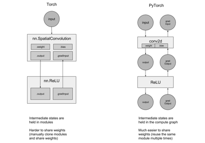

# PyTorch for former Torch users

**Author**: [Soumith Chintala](http://soumith.ch)

在本教程中, 你将学习到以下内容:

1.  使用 torch Tensors, 它和 (Lua)Torch 有很大的不同
2.  使用 autograd package
3.  构建神经网络

> *   构建一个 ConvNet
> *   构建一个 Recurrent Net

1.  使用多个 GPUs

[Tensors](former_torchies/tensor_tutorial.html#sphx-glr-beginner-former-torchies-tensor-tutorial-py)

[Autograd (自动求导)](former_torchies/autograd_tutorial.html#sphx-glr-beginner-former-torchies-autograd-tutorial-py)

[nn package](former_torchies/nn_tutorial.html#sphx-glr-beginner-former-torchies-nn-tutorial-py)

[Multi-GPU examples](former_torchies/parallelism_tutorial.html#sphx-glr-beginner-former-torchies-parallelism-tutorial-py)